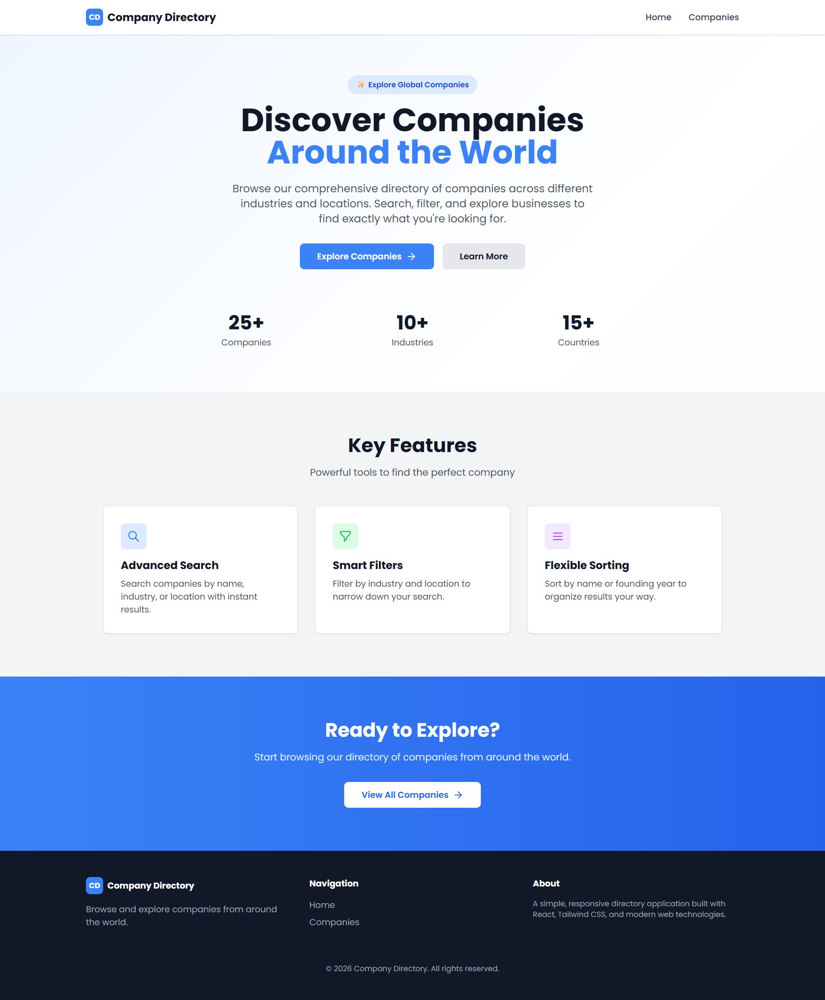
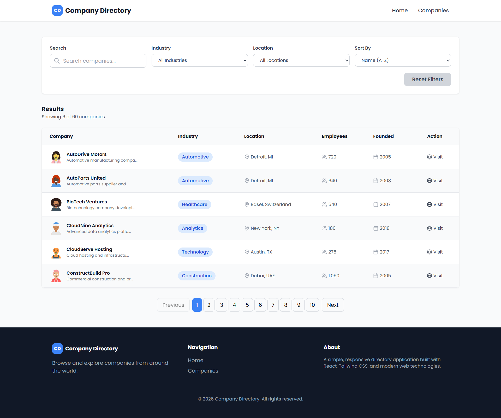
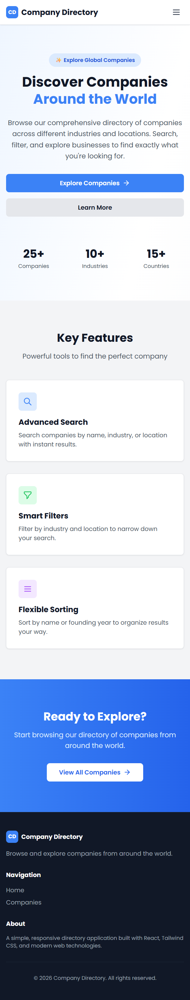

# Deployed Link
https://company-directory-app.netlify.app/

# Company Directory 

A modern, responsive web application to discover and explore global companies across various industries and locations. Built with React, Vite, and Tailwind CSS.


## 📝 About

Company Directory is a lightweight web application that allows users to browse and filter a comprehensive database of 60+ companies from around the world. The application provides an intuitive interface to search, filter, and sort companies by various criteria including industry, location, founding year, and name.

## 📸 Screenshots






## 🛠 Tech Stack

### Frontend
- **React 19.2** - UI library for building interactive components
- **React Router 7.15** - Client-side routing for multi-page navigation
- **Vite 8.0** - Ultra-fast build tool and dev server

### Styling
- **Tailwind CSS 3.4** - Utility-first CSS framework
- **PostCSS 8.5** - CSS transformations and autoprefixing

### Icons & Utilities
- **Lucide React 1.14** - Beautiful, consistent SVG icons
- **ESLint** - Code quality and style checking

### Development Tools
- **Node.js** - JavaScript runtime
- **npm** - Package manager


## 📁 Project Structure

```
company-directory/
├── public/                          # Static assets
├── src/
│   ├── api/
│   │   └── companiesApi.js         # API calls to fetch company data
│   ├── assets/                      # Images and static files
│   ├── components/
│   │   ├── CompanyTable.jsx        # Company table/card display
│   │   ├── Footer.jsx              # Footer component
│   │   ├── Loader.jsx              # Loading spinner
│   │   ├── Navbar.jsx              # Navigation bar
│   │   └── index.js                # Component exports
│   ├── pages/
│   │   ├── Home.jsx                # Landing page with features
│   │   ├── Companies.jsx           # Main companies directory page
│   │   ├── NotFound.jsx            # 404 page
│   │   └── index.js                # Page exports
│   ├── utils/
│   │   ├── constants.js            # App constants (sort options)
│   │   └── debounce.js             # Debounce utility function
│   ├── App.jsx                     # Main app component with routing
│   ├── index.css                   # Global styles
│   └── main.jsx                    # React entry point
├── vite.config.js                 # Vite configuration
├── tailwind.config.js             # Tailwind CSS configuration
├── postcss.config.js              # PostCSS configuration
├── package.json                   # Project dependencies
├── package-lock.json              # Dependency lock file
└── README.md                       # This file
```

## 🚀 Installation

### Prerequisites
- Node.js (v14 or higher)
- npm (v6 or higher)

### Steps

1. **Clone the repository**
  

2. **Install dependencies**
   ```bash
   npm install
   ```

3. **Verify installation**
   ```bash
   npm list
   ```

## ▶️ How to Run

### Development Mode
Start the development server with hot module replacement:
```bash
npm run dev
```
The application will be available at `http://localhost:5173`

### Build for Production
Create an optimized production build:
```bash
npm build
```

### Preview Production Build
Preview the production build locally:
```bash
npm preview
```

### Code Linting
Check code quality and style:
```bash
npm lint
```


## ✨ Features

### 🔍 **Advanced Search**
- Real-time search across company names, industries, and locations
- Debounced search input for optimal performance
- Clear search button to quickly reset

### 🎯 **Smart Filters**
- Filter by Industry: Choose from 15+ industries
- Filter by Location: Browse companies by geographic location
- Combine multiple filters for precise results
- Reset all filters with one click

### 📊 **Flexible Sorting**
- Sort by name (A-Z or Z-A)
- Sort by founding year (Newest or Oldest)
- Maintains sort order while filtering

### 📄 **Pagination**
- Display 6 companies per page
- Easy navigation between pages
- Current page indicator

### 📱 **Responsive Design**
- Mobile-first approach
- Fully responsive layout for all screen sizes
- Optimized desktop and mobile views

### 🎨 **Modern UI/UX**
- Clean and intuitive interface
- Smooth animations and transitions
- Loading, error, and empty states
- Professional color scheme and typography

### 🔗 **Direct Company Links**
- Quick links to company websites
- Opens in new tab for better UX

### 📊 **Company Information Display**
- Company logo and name
- Industry badge
- Location with map icon
- Employee count
- Founded year
- Brief company description


## 📖 Usage Guide

### Home Page
1. Navigate to the home page to see an overview of the application
2. View key features and statistics
3. Click "Explore Companies" to go to the companies directory

### Companies Directory Page
1. **Search**: Use the search box to find companies by name, industry, or location
2. **Filter by Industry**: Select an industry from the dropdown to filter results
3. **Filter by Location**: Select a location from the dropdown to filter results
4. **Sort Results**: Choose a sort option (Name A-Z, Name Z-A, Newest Founded, Oldest Founded)
5. **Reset Filters**: Click "Reset Filters" to clear all filters and sorting
6. **Pagination**: Navigate between pages using Previous/Next buttons or click page numbers
7. **Visit Website**: Click the "Visit" button to open a company's website in a new tab

### Mobile Navigation
- All features are fully responsive on mobile devices
- Touch-friendly buttons and inputs
- Collapsible menus and cards

## 🔌 API Endpoints

### Base URL
```
http://localhost:5173/api
```

### Endpoints

**Get All Companies**
```
GET /companies
```
Returns array of all companies in the database.

**Response Structure**
```json
{
  "companies": [
    {
      "id": 1,
      "name": "Company Name",
      "logo": "https://api.dicebear.com/7.x/avataaars/svg?seed=Company",
      "industry": "Technology",
      "location": "San Francisco, CA",
      "employees": 250,
      "founded": 2015,
      "description": "Company description...",
      "website": "www.company.com"
    }
  ]
}
```

## 💾 Data Structure

### Company Object
```javascript
{
  id: number,                    // Unique identifier
  name: string,                  // Company name
  logo: string,                  // Logo URL
  industry: string,              // Industry category
  location: string,              // Geographic location
  employees: number,             // Number of employees
  founded: number,               // Year founded (YYYY)
  description: string,           // Company description
  website: string                // Website URL (without https://)
}
```

### Industries
- Technology
- Analytics
- Healthcare
- Finance
- Energy
- Retail
- Education
- Media
- Real Estate
- Construction
- Hospitality
- Logistics
- Consulting
- Fashion
- Telecommunications

### Current Data
- **Total Companies**: 60
- **Total Industries**: 15+
- **Total Locations**: 20+
- **Countries Represented**: 10+

### Home Page
- Hero section with call-to-action buttons
- Feature highlights section
- Statistics showcase
- Hero gradient background

### Companies Directory
- Search bar with clear button
- Industry and Location filter dropdowns
- Sort options dropdown
- Reset Filters button
- Results counter
- Company table (desktop) / Card view (mobile)
- Pagination controls

### Loading State
- Animated spinner icon
- Loading message

### Error State
- Error icon
- Error message
- Retry button

### Empty State
- Search icon
- "No companies found" message
- Reset Filters button


#
